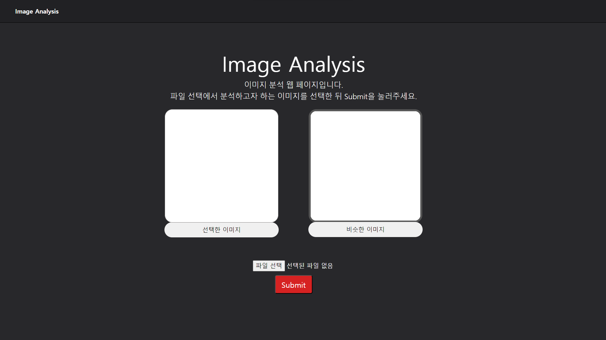

# img making
#### 조장: 전영준

#### 조원:이동언, 최지호

## 1. 개 요
* * *
이번 프로젝트에서는 이미지 분류 인공지능 API를 활용해서
 이미지 분류 서비스를 제공해보고자 한다. 이미지에 관한 라벨을 추출하여
 새로운 이미지를 생성하는 웹 페이지를 개발해 보려고 한다.

## 2. 활용할 인공지능 API
* * *
 - cloud vision API
## 3. 웹 페이지 구축
### 3.1 cloud vision API 호출
***
cloud vision API key를 받고 javascript코드에 입력하여 호출한다.
### 3.2 이미지 분석
### 3.3 웹 페이지 디자인
 - 웹 페이지 디자인

## 4.API 활용
* * *
### 4.1 API 활용 예시
 - cloud vision API

## 5. 실행 결과
* * *
 이미지를 삽입하면 cloud vision API를 호출해 이미지를 분류한다.
 
 - 웹 페이지 실행 결과

